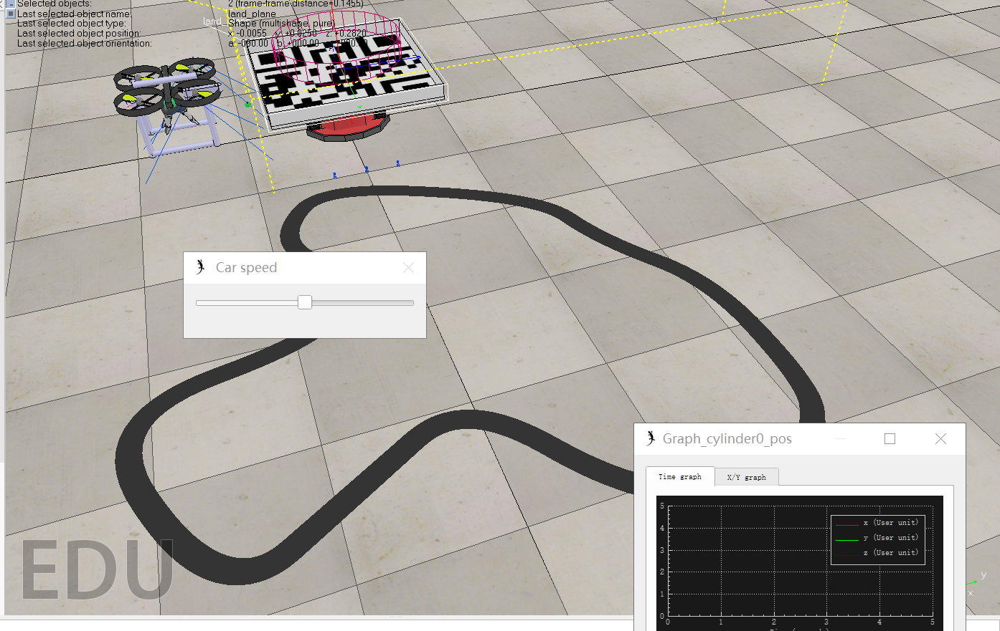
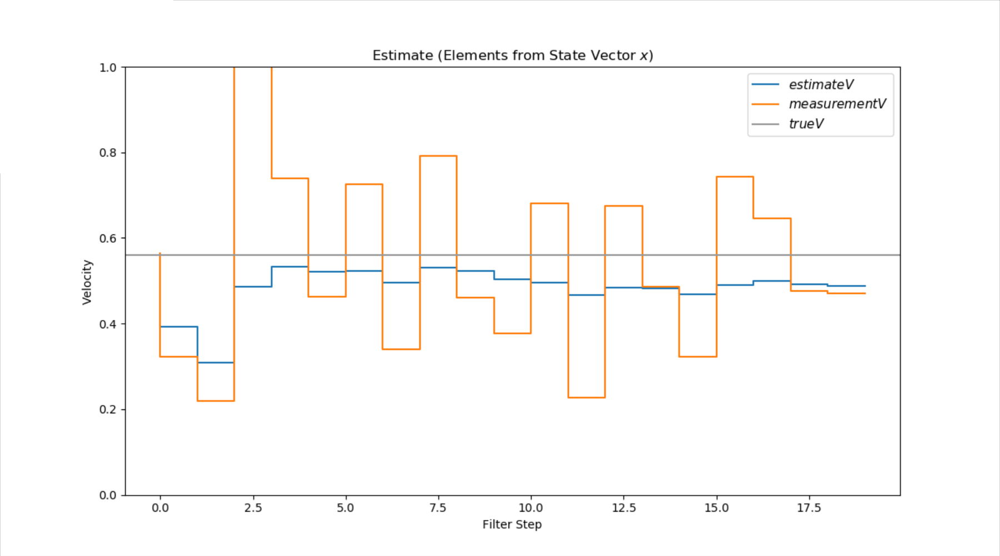
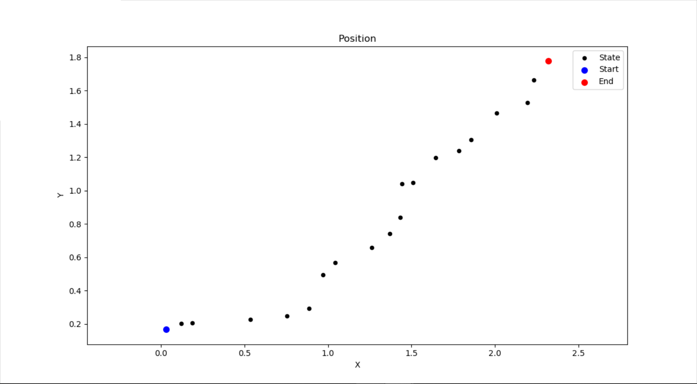
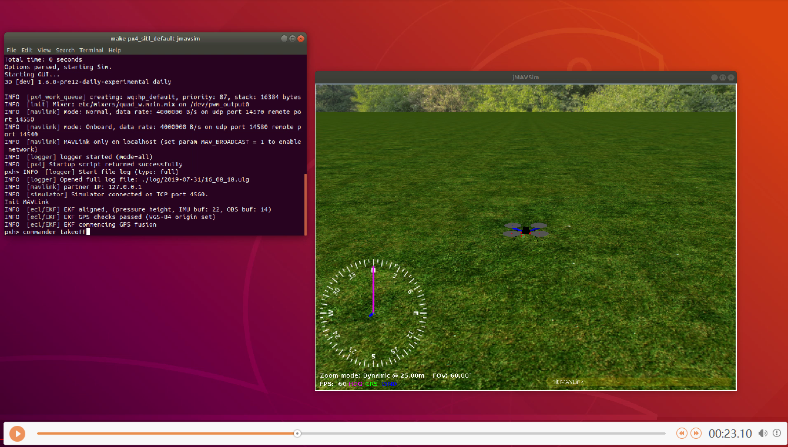
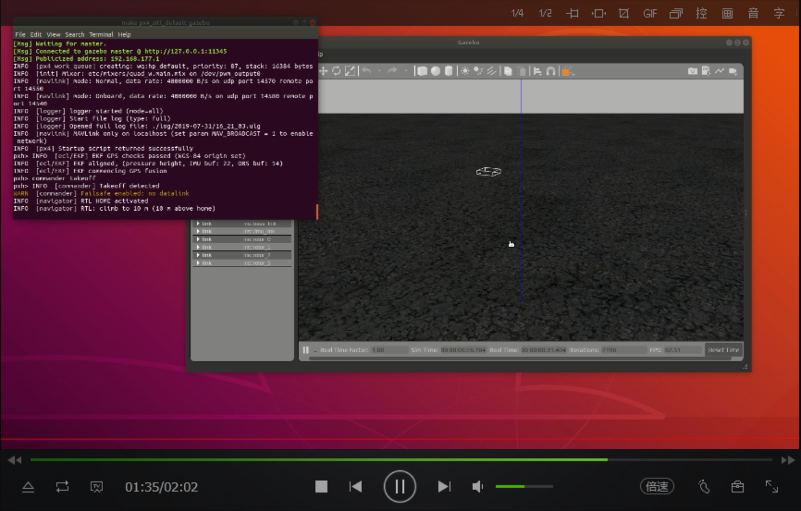
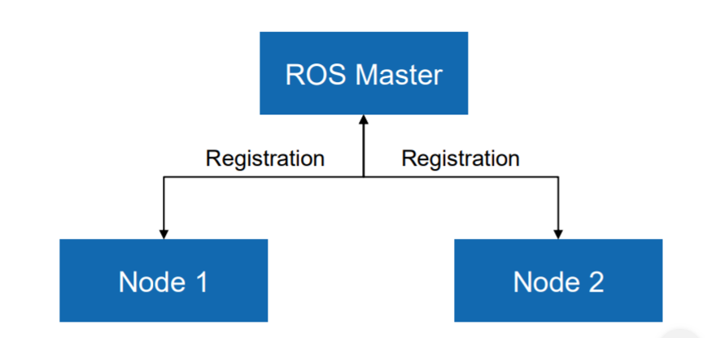

<h2>
结课报告
</h2>

计64	嵇天颖	2016010308

---

**目录**

[TOC]

---

### 1	Landing

#### 1.1 	设计题目

**`Landing`**任务主要分为以下两个部分：

* 添加可收放起落架（质量设置为零），并导出为`drone_grapper_with_gear.ttm`（30’）

* 利用`remoteApi `完成移动小车上的降落功能（70’）

我在这部分主要负责可收放起落架的搭建与移动小车的搭建，我在自己查阅资料和助教的帮助下在`V-rep`上实现了这两个模型的构建

#### 1.2	可收放起落架

##### 1.2.1	设计实现

**STEP 1	Primitive Shape**

我们设计中采用`Primitive Shape`中的`Cylinder`来构成起落架的形状，左右两个起落架对称设计，期间需要多次调整角度、长度以及粗细参数，并设置其属性为`Collidable`

**STEP 2	Group**

通过`Menu`中`Edit`的`Grouping`使得构成起落架的3根`Cyinder`组合在一起，并设置质量属性为为10-5数量级。

**STEP 3	Force Sensor**

在构建可收放起落架时可以采用两种方法：用`Joint`连接或者`Force Sensor`与无人机连接。

`V-REP`中可以添加力传感器`Force Sensor`，用于刚性连接在两个物体之间以测量这两个物体之间的作用力或力矩。

在尝试中发现`Force Sensor`的效果更好，因此采用了`Force Sensor`来连接。

##### 1.2.2	实验结果

无人机起落架模型结果如图所示：

##### 1.2.3	实验总结

搭建起落架是第一周的主要工作之一，起初对于`V-REP`很不熟悉，而相关的教程又寥寥，所以一开始进展起来很不顺利。

在请教了助教后，终于慢慢地实现了起落架，这里的难点基本就在于力传感器了。

##### 1.2.4	参考文献

> 参考文献[1]是一个关于小车的例子，其实是参考文献[2]（`V-REP`官网教程 `tutorial/BubbleRob tutorial`）的拓展版本，有关于构建`Cylinder`，`Group`和力传感器的具体步骤介绍，对上手帮助很大

[1]	https://zhuanlan.zhihu.com/p/32967284

[2]	http://www.coppeliarobotics.com/helpFiles/index.html

---

#### 1.3	移动变速降落平台

无人机降落任务中要求提供一个移动的降落平台，与其他组不同的是，我设计实现了一个可设计轨道可变速的移动降落平台而不是随机运动的降落平台。

##### 1.3.1	设计实现

**STEP 1 	Path**

我们需要为降落平台设置路径

建立路径：具体操作：`Menu bar --> Add --> Path --> Circle type`，接着我们有两种方法调整路径：

* `Ctrl`+选择控制点，拖拽
* 进入`path`编辑模式，有更高的灵活性

**STEP 2	Vision Sensor**

首先创建要放在`BubbleRob`上的三个视觉传感器，即 `[Menu bar --> Add --> Vision sensor --> Orthographic type]`新建三个`vision sensor`，左中右各一个，然后根据`path`的宽度和车头的宽度和位置来设置三个视觉传感器的位置。

为了循迹，每个视觉传感器都要面向地面，则设置它们姿态，即在姿态对话框中设置 `[180;0;0] for the Alpha-Beta-Gamma items`。

在循迹过程中我们要读取视觉传感器数据，但这里的情况较简单，因为我们视觉传感器只有`one pixel`，所以我们只要查询视觉传感器所读到图像的平均强度值就行了。对于复杂情况，还要设置传感器的`filters`。

接着，修改层次树，`attach`三个视觉传感器:

~~~python
.-Car
	- leftSensor
	- middleSensor
	- rightSensor
~~~

**STEP3	Script**

用脚本定义降落平台的循迹行为，创建一个`script`

1	Vision Sensors

首先我们需要将视觉传感器绑定脚本，后面才可以利用视觉传感器的数据

~~~lua
--Add vision sensors
floorSensorHandles={-1,-1,-1}
floorSensorHandles[1]=sim.getObjectHandle("leftSensor")
floorSensorHandles[2]=sim.getObjectHandle("middleSensor")
floorSensorHandles[3]=sim.getObjectHandle("rightSensor")
~~~

2	Control UI

我们在这里实现了可变速的移动降落平台，并为速度加了可视化的控制器，可以通过控制速度滑块来实时改变降落平台的运动速度

~~~lua
-- Create the custom UI:
xml = '<ui title=" Car speed" closeable="false" resizeable="false" activate="false">'..[[
<hslider minimum="0" maximum="100" on-change="speedChange_callback" id="1"/>
<label text="" style="* {margin-left: 300px;}"/>
</ui>
]]
ui=simUI.create(xml)
speed=(minMaxSpeed[1]+minMaxSpeed[2])*0.5
simUI.setSliderValue(ui,1,100*(speed-minMaxSpeed[1])/(minMaxSpeed[2]-minMaxSpeed[1]))
~~~

3	Path Detection

通过三个视觉传感器来判断地面的黑线,`data[11]`代表传感器所捕捉图像的灰度平均值，设立一个阈值为`0.3`，大于这个值则视为捕捉到黑线。

~~~lua
-- read the line detection sensors:
sensorReading={false,false,false}
for i=1,3,1 do
    result,data=sim.readVisionSensor(floorSensorHandles[i])
    if (result>=0) then
        sensorReading[i]=(data[11]<0.3) -- data[11] is the average of intensity of the image
    end
end
~~~

4	 Motor Speed

首先为车轮设置转向速度：如果左边捕捉到黑线，则向右旋转，右边捕捉到黑线，则向左旋转

~~~lua
if sensorReading[1] then
    leftV=0.04*speed
end
if sensorReading[3] then
    rightV=0.04*speed
end
~~~

如果左右两个传感器同时捕捉到黑线，则会直接前进或者后退：

~~~lua
if sensorReading[1] and sensorReading[3] then
    backUntilTime=sim.getSimulationTime()+2
end
~~~

设置两种运动模式——前（`forward mode`）后（`backward mode`）运动,并为之设置速度控制：

~~~lua
if (backUntilTime<sim.getSimulationTime()) then
    -- When in forward mode, we simply move forward at the desired speed
    sim.setJointTargetVelocity(motorLeft,leftV)
    sim.setJointTargetVelocity(motorRight,rightV)
else
    -- When in backward mode, we simply backup in a curve at reduced speed
    sim.setJointTargetVelocity(motorLeft,-speed/2)
    sim.setJointTargetVelocity(motorRight,-speed/8)
end
~~~

##### 1.3.2	实验结果

* 所设计的移动可变速降落平台模型如图所示：

* 其真实运行效果见`demo`文件夹下的`car.mp4`

##### 1.3.3	实验总结

这个移动变速降落平台搭建过程在大部分环节都比较顺利，比较麻烦的地方在于参数的调试。

比如左或者右传感器检测到路径时究竟给左右轮加多大的转向速度，因为速度过大会导致偏向过大而在转向后三个传感器都检测不到路径，而过小会使得转向无效。

比如在三个传感器都检测到路径时，如何调整前进后退模式的速度也是尤为重要的问题，稍有不慎，小车就会沿着路径的切线方向奔向远方或者在原地打转。

当然我们可变速的设置为上面所说的参数设置带来了很大的麻烦，因为小车的速度变化范围大，我们需要满足慢车速和快车速的情况下都能够正常运行，就要根据小车速度来进行调控，确实尝试了非常久。

##### 1.3.4	参考文献

> 跟着官网教程（[1])中`Line following BubbleRob tutorial`基本就可以搭建出`Path`和`Vision Sensor`部分
>
> 然后参考文献[2]有对官网教程代码的讲解，仿照官网教程的代码可以实现我们的移动降落平台的控制

[1]	http://www.coppeliarobotics.com/helpFiles/index.html
[2]	https://blog.csdn.net/feriman/article/details/88982066

---

### 2	People Following

#### 2.1 	设计题目

**`People Following`**任务主要分为以下两个部分：

- 找到指定桌面`home `下`target`文件夹中的指定的照片中的人（50’）
- 跟随找到的人（50’）

我在这部分主要负责实现目标跟踪，主要采用的算法是**卡尔曼滤波**。卡尔曼滤波是一个非常控制论的算法，基本类似于离散系统的校正。

#### 2.2	设计实现

##### 2.2.1	算法原理

**问题背景**：为了估计一个事物的状态，我们先去测量它，但我们不能完全相信我们的测量，因为测量是不精确的，它往往会存在一定的噪声，因此我们要去估计我们的状态。卡尔曼滤波及其拓展算法能够应用于目标状态估计。
$$
Measurement^{(t)} = trueValue^{(t)}+Noise^{(t)}
$$

**状态量与预测量：**卡尔曼滤波法是结合预测（先验分布）和测量更新（似然分布）的状态估计算法。

卡尔曼滤波通过同时考虑上一状态值和当前的测量值来获得对当前状态值的估计。
$$
\hat{x_k} = \hat{x_{k-1}} + g_k(z_k -\hat{x_{k-1}})
$$
gk是卡尔曼增益（Kalman Gain)，它描述的是之前的估计和当前的测量对当前的估计的影响的分配权重。

**传感器测量噪声：**我们认为一般而言，测量误差符合正态分布

**计算卡尔曼增益**：我们虽然不知道测量噪声vk的值，但是我们知道它的均值，前面我们提到，测量噪声来自传感器本身，并符合高斯分布，所以我们能够从传感器那里获得测量噪声的均值r。

那么gk可以表示为：
$$
g_k = p_{k-1}/(p_{k-1}+r)
$$
pk叫预测误差：
$$
p_k = (1 - g_k)p_{k-1}
$$

##### 2.2.2	状态预测与更新

**预测：**F-预测矩阵，B-控制律，H-测量矩阵，K-卡尔曼增益，P-误差协方差矩阵

* 状态预测：
  $$
  x_{k+1}= Fx_k+Bu_k
  $$

* 

$$
P_{k+1}= FP_kA^T
$$

**校正：**用上一状态值和当前的测量值来获得对当前状态值的估计
$$
K_k = P_k H^T (HP_kH^T + R)^{-1}\\
\hat {x_k} \leftarrow \hat{x_k} +K_k(z_k - H\hat{x_k})\\
P_k \leftarrow (1- K_kH)P_k
$$

##### 2.2.3	算法应用

**误差来源**：

* 对于行人位置和速度的测量值是通过无人机视觉拍摄的图片进行计算后得到的，存在计算误差
* 我们认为输入即拍摄的图片和实际是无误差的
* 行人并不一定做匀速运动，状态非线性

**状态方程：**

* 在状态预测中，B是控制律矩阵

* 为了简化设计，我们认为目标跟踪的对象行人无内部控制率
  $$
  \hat{x_k} = F\hat{x_{k-1}}
  $$

**参数设置**：

根据`mission_people_follow`模型中的`script`，我们设置参数如下：

* 行人速度：0.56m/s

* 测量间隔：0.3s

* 噪声误差：满足正态分布

  ~~~python
  mx = np.array(abs(vx*np.random.randn(m)))
  my = np.array(abs(vy*np.random.randn(m)))
  ~~~

**卡尔曼滤波**：

根据前面介绍的原理与状态公式实现：

~~~python
# 卡尔曼滤波
for n in range(len(measurements[0])):
    # Project the state ahead
    x = F*x
    # Project the error covariance ahead
    P = F*P*F.T + Q
    # Compute the Kalman Gain
    S = H*P*H.T + R
    K = (P*H.T) * np.linalg.pinv(S)
    # Update the estimate via z
    Z = measurements[:,n].reshape(2,1)
    y = Z - (H*x)                           
    x = x + (K*y)
    # Update the error covariance
    P = (I - (K*H))*P
    # Save states (for Plotting)
    savestates(x, Z, P, R, K)
~~~

#### 2.3	效果分析

在理想情况下，我们分析了利用卡尔曼滤波进行目标跟踪的效果：

理想情况设置如下：

* 行人速度：0.56m/s（匀速运动）
* 测量间隔：0.3s（保证每次测量不丢帧）
* 噪声误差：满足正态分布

行人速度预测效果如下图：

* 黑色线代表真实的行人速度即0.56m/s

* 橙色线为测量值，可以看出来测量值受限于单目视觉坐标计算，波动较大，误差方差很大
* 蓝色线为利用卡尔曼滤波后得到的状态值，较之测量值有很大优化，波动小，误差小

行人位置预测效果如下图：

* 蓝色点为起始位置点，红色点为结束位置点
* 黑色散点为每隔0.3s测量时间，所得到的位置状态量
* 真实路径为过蓝色和红色点的线段
* 我们可以发现黑色散点关于真实位置上下波动，误差在可接受范围内，效果较为稳定

#### 2.4	问题分析与解决

实际运行中无法满足理想情况，在初始版本中主要出现了以下两种问题：

**问题1**：当无人机飞到人的头顶上空时，无人机视觉无法看到人的脸，也无法看到人的上衣和裤子颜色，此时出现丢帧现象，无法进行人脸检测与衣服识别。缺少当前帧的测量值，会使得预测状态值无法更新，即无法进行下一步预测。

* 尝试方法1：

  我们设置卡尔曼矩阵为零矩阵，即直接利用上一次的预测值。

  但会出现问题，因为大概率上，上一次预测值和当前位置重合度较高，无人机会长时间悬停在人头顶上方。

* 尝试方法2：

  设置recognize标志，如果丢失目标，则环绕并扫视，大部分情况下，这已经解决了丢帧问题。这是较为创新的地方，因为卡尔曼滤波一般只能处理线性问题，这里非常简单地拓展处理了非线性问题，当人转弯的时候也能正常跟随。

  当环绕扫视仍然找不到目标，会沿特定路线返航，但一般不会出现这种问题。这里是为了程序的鲁棒性而进行的设置。

**问题2：**我们会每隔0.3s进行一次测量与运算，但有时候测量的时候，无人机恰好还在飞往上一次的目标点的过程中，由于无人机飞行过程中是低头的，经常视野中只有地面，缺少测量值。

* 尝试方法：

  这里的处理方式较为简单，我们充分信任预测值，按预测值飞行，即设置卡尔曼矩阵为零矩阵，直到下一次获取到帧

#### 2.5 展望：效果改进

**卡尔曼滤波存在的问题：**对线性情况处理很好，但非线性情况处理能力堪忧。虽然我们通过设置`recognize`标志来处理一些非线性情况，但会出现无人机悬停时间较长的问题。

**CTRV模型：**增加偏航角和偏航角速度来处理行人转向问题

​						CTRV模型中状态公式为：
$$
\vec{x}(t+\Delta t)=\begin{bmatrix}
\frac{v}{w}sin(\omega \Delta t + \theta - \frac{v}{w}sin(\theta) + x(t))\\
-\frac{v}{w}cos(\omega \Delta t + \theta + \frac{v}{w}cos(\theta) + y(t))\\
v\\
\omega \Delta t + \theta\\
\omega
\end{bmatrix}
$$
**拓展卡尔曼滤波：**用泰勒展开来进行线性化，从而将非线性问题线性化，JA是雅克比矩阵，是CTRV模型中各项求偏导所得。

其预测公式为：
$$
x_{k+1} = g(x_k,u)\\
P_{k+1} = J_AP_kJ_A^T +Q
$$

#### 2.6	实验总结

作为唯一一个修了系统分析与控制的同学，义无反顾负责了目标控制的部分。之前调研了光流法和卡尔曼滤波，但光流法的问题在于需要提供较多的帧数进行优化选择，而卡尔曼滤波迭代层数少，速度快。但卡尔曼滤波的问题在于它对非线性的情况处理能力有限，为此我们进行了一系列的尝试和改良。这部分比较偏算法，没有太多的模型和平台的问题，完成的还算比较顺利。参考的资料也很多，也没有什么深坑出现。

这部分主要的创新点在于拓展了卡尔曼滤波对于非线性情况的处理，并同时增强了程序的鲁棒性，即使是丢失视野也可以顺利完成目标跟踪任务。

#### 2.7	参考文献

> 参考文献[1]的状态量设置比较与众不同，对位置的判断更为精准，可以参考。最终我们采取的是参考资料[2]的状态量设置方法，即位置和速度。

[1]	https://patentimages.storage.googleapis.com/c6/76/e1/5522c86c126cbc/CN106952295A.pdf
[2]	https://ieeexplore.ieee.org/abstract/document/5940526
[3]	https://blog.csdn.net/AdamShan/article/details/78265754
[4]	https://blog.csdn.net/ethan_guo/article/details/80536123

---

### 3	Hardware

我还进行了硬件方面的探索学习，主要是学习PX4的工具链安装，进行仿真环境试验，学习MAVLink协议，学习使用ROS的机器人，用Linux进行外部控制，测试MAVROS外部控制例程。同时进行了实际的六旋翼飞机的飞行实践，通过GStreamer来获取视频流，通过QGroundControl获得地面站的信息。

#### 3.1	PX4

##### 3.1.1	Toolchain

PX4代码可以在MacOS,Linux或者上进行开发，建议在Mac OS和Linux上进行开发，因为图像处理和高级导航在windows上不容易开发。

起初我尝试了在windows上进行开发，但windows支持的仿真平台极少，不支持Gazebo。因为在与硬件连接时，有两种可行方案，一是用MAVLink协议封装V-REP，或者可以将V-REP的模型移植到Gazebo上，因为Gazebo与PX4已经有MAVLink协议连接。

因此后来借用队友和助教的电脑，重新在Linux上进行开发。

##### 3.1.2	jMavSim

我们开始尝试jMavSim进行仿真处理：

运行如下指令：

~~~c++
cd PX4\Firmware
make px4_sitl jmavsim
commander takeoff
commander land
~~~

commander takeoff可以控制无人机起飞

commander land可以控制无人机降落

可以获得如下界面：

具体的demo视频见demo文件夹中`video-jmavlink.mp4`

我们尝试测试用pytho脚本来进行命令控制，实现仿真：

~~~c++
make px4_sitl jmavsim
python test_commander.py
~~~

运行可得一无人机在空中环绕的效果，并且打开QGroundControl可以看到飞行的轨迹图。

具体的demo视频见demo文件夹中的`video-commander.mp4`。

##### 3.1.3	Gazebo

与jMavSim类似地，我们可以测试相同的程序在Gazebo仿真平台上

可以获得如下的仿真界面：

具体的demo视频见demo文件夹中`video-gazebo.mp4`

##### 3.1.4	Marvos

MAVROS ROS包允许在运行ROS的计算机、支持MAVLink的飞控板以及支持MAVLink的地面站之间通讯。虽然MAVROS可以用来与任何支持MAVLink的飞控板通讯，但是我们仅就PX4飞行栈与运行ROS的协同计算机之间的通讯进行探索。

MAVROS学习中我们关注两个东西，一个是工作空间，这是创建时所需要的，另一个是节点，MAVROS通过节点来控制ROS机器人。

**Workspace**

* 创建工作空间后需要`source devel/setup.bash`

**Nodes**

MAVROS通过节点来控制ROS机器人：

* 编写节点

* 运行节点`rosrun package_name node_name`

  

**offb_node.cpp**

例程提供的offb_node.cpp实现了基本的外部控制，通过MAVROS应用在Gazebo模拟的Iris四旋翼上，实现的效果是无人机缓慢起飞到高度2米。

* mavros_msgs包含有所有用于MAVROS服务和主题的自定义消息。

  ~~~c++
  #include <mavros_msgs/CommandBool.h>
  #include <mavros_msgs/SetMode.h>
  #include <mavros_msgs/State.h>
  ~~~

* 创建一个简单的回调函数，它可以保存飞控的当前状态。我们可以用它检查连接状态，解锁状态以及外部控制标志。

  ~~~c++
  mavros_msgs::State current_state;
  void state_cb(const mavros_msgs::State::ConstPtr& msg){
      current_state = *msg;
  }
  ~~~

* 我们实例化一个用来发布指令位置的发布器，一个请求解锁的客户端和一个请求改变模式的客户端。

  ~~~c++
  ros::Subscriber state_sub = nh.subscribe<mavros_msgs::State>("mavros/state", 10, state_cb);
  ros::Publisher local_pos_pub = nh.advertise<geometry_msgs::PoseStamped>("mavros/setpoint_position/local", 10);
  ros::ServiceClient arming_client = nh.serviceClient<mavros_msgs::CommandBool>("mavros/cmd/arming");
  ros::ServiceClient set_mode_client = nh.serviceClient<mavros_msgs::SetMode>("mavros/set_mode");
  ~~~

* px4飞行栈在外部控制指令之间有500ms的时限，如果超过了时限，那么飞控将会切换回进入外部控制模式之前的模式，因此发布频率必须高于2Hz的原因。

  ~~~c++
  //the setpoint publishing rate MUST be faster than 2Hz
  ros::Rate rate(20.0);
  ~~~

* 在发布之前，需要等待MAVROS和飞控建立连接。一旦接收到心跳包，该循环就会立即退出。

  ~~~c++
  // wait for FCU connection
  while(ros::ok() && current_state.connected){
      ros::spinOnce();
      rate.sleep();
  }
  ~~~

* px4飞行栈工作在航空常用的NED坐标系，但MAVROS仍然会将这些坐标转换到标准的ENU坐标系，因此我们设置Z为2.

  ~~~c++
  geometry_msgs::PoseStamped pose;
  pose.pose.position.x = 0;
  pose.pose.position.y = 0;
  pose.pose.position.z = 2;
  ~~~

* 在进入外部控制模式之前，就必须开始发布指令，否则模式切换会被拒绝。这里，100是个随意选取的值。

  ~~~c++
  //send a few setpoints before starting
  for(int i = 100; ros::ok() && i > 0; --i){
      local_pos_pub.publish(pose);
      ros::spinOnce();
      rate.sleep();
  }
  ~~~

* 设置自定义模式为`OFFBOARD`

  ~~~c++
  mavros_msgs::SetMode offb_set_mode;
  offb_set_mode.request.custom_mode = "OFFBOARD";
  ~~~

* 在解锁并起飞后，不断地请求切换至外部控制模式。在请求之间间隔5秒，不至于让飞控响应不过来。在同样的循环里，以合适的频率持续发送位姿指令。

#### 3.2	Gstreamer & QGroundControl

我们一共进行了两次真实的飞行实践。

第一次在2019/07/08，我们进行了Gstreamer和QGroundControl的安装和学习，然后到了实际场地进行测试。但由于当天无人机的主控电脑出现问题，无法传送视频流，我们只进行了QGroundControl的关于飞行轨迹高度和速度的观测。

第二次在2019/07/30，我们对Gstreamer和QGroundControl均进行了观测，并亲手操控了无人机的飞行。我们对无人机的指令接受延迟有了直观的感受，延迟还是比较严重的。

#### 3.3	实验总结

硬件部分是我进展起来最为吃力的部分，因为系统架构复杂，相关资料寥寥，学习起来很吃力。而且前期企图在Windows上进行实践浪费了很多的功夫，而在Linux上安装和运行又是各种Bug横行，非常费功夫。

真是的飞行实践真的是紧张又刺激，我之前对无人机接受指令的延迟没有较好的预判，因此上手时操作不稳，差点撞机，还好助教一顿极限操作拉了回来。

#### 3.4	参考文献

> 硬件部分的参考资料真的是少之又少，而且各种坑无穷之多。
>
> 首先的忠告就是不要企图尝试windows
>
> 然后PX4的中文wiki真的是翻译的很诡异而且内容差了很多，应该是很久没有更新的原因。
>
> PX4的官方文档对Gazebo的讲解非常敷衍，然后参考文献[3]中的Gazebo的官方手册讲解很到位，直接看这个可以避雷特别多。
>
> 有一个非常坑的地方在于官方手册中ROS/Gazebo只提供了支持Ubuntu18.0及以上的安装与操作指南。而我借用同学的电脑，同学电脑是Ubuntu16.0，因为不能乱改别人的操作系统，在摸索了很久之后，终于找到了16.0相应的操作指南：参考文献[8]。其实主要的区别就是版本名，16.0对应的版本名为`kinetic`，如果是其他版本还可以到`ROS`的`wiki`上去寻找相应的版本。

[1]	http://dev.px4.io/master/en/index.html（中文wiki和这个差别还是挺大的）
[2]	https://rsl.ethz.ch/education-students/lectures/ros.html
[3]	http://gazebosim.org/tutorials?cat=get_started （Gazebo手册,比PX4中讲Gazebo部分明白多了）
[4]	https://github.com/PX4/Firmware/tree/master/integrationtests/python_src/px4_it/mavros
[5]	https://mavlink.io/en/
[6]	https://pixhawk.ethz.ch/mavlink/
[7]	https://docs.qgroundcontrol.com/en/
[8]	http://wiki.ros.org/kinetic（ubuntu16.0的系统ROS/Gazebo操作指南）

