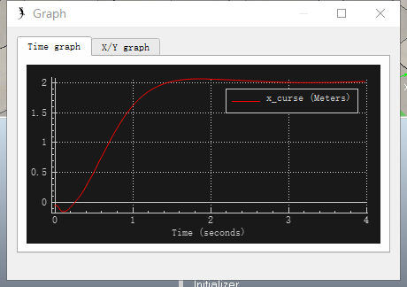

# PID说明

## 四旋翼PID系统

四旋翼共有4个参数可以调节，分别为推力、alpha转动、beta转动、偏航转动

推力PID由与目标位置差组成的相关PID参数调节，并辅以速度

alpha、beta转动，可以让四旋翼在x-y平面上移动，除了转动组成的PID以外，与目标点距离的PID组成，也就是有两组PID串联，但实际上第二组不使用积分，这样可以让控制更加稳定

偏航决定曲线移动，暂未测试，可以尝试折线运动方式，通过悬停让飞行器稳定

## 初始调节

由于质量分布不均匀，初始状态四个旋翼的力不等，略有偏差，可以保证在无反馈控制情况下4s稳定

## 可控范围

x、y单轴移动只需要alpha、betaPID参数即可，target上限可以有2m

xy双轴移动，实测仅可在target各距1m的距离可以稳定飞行

z轴target可距离1m

## 单次上限运动曲线

## 速度

速度上限在2m/s左右，根据实际的姿态不同略有差异

## 参考文献

《模糊自整定PID在四旋翼飞行器姿态控制中的应用》

《智能PID整定方法的仿真与实验研究》李瑞霞